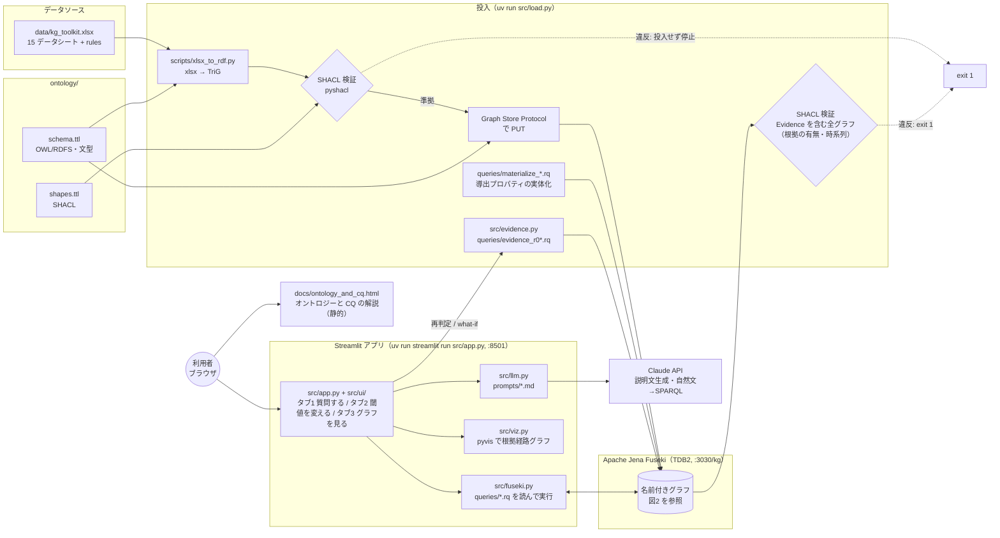
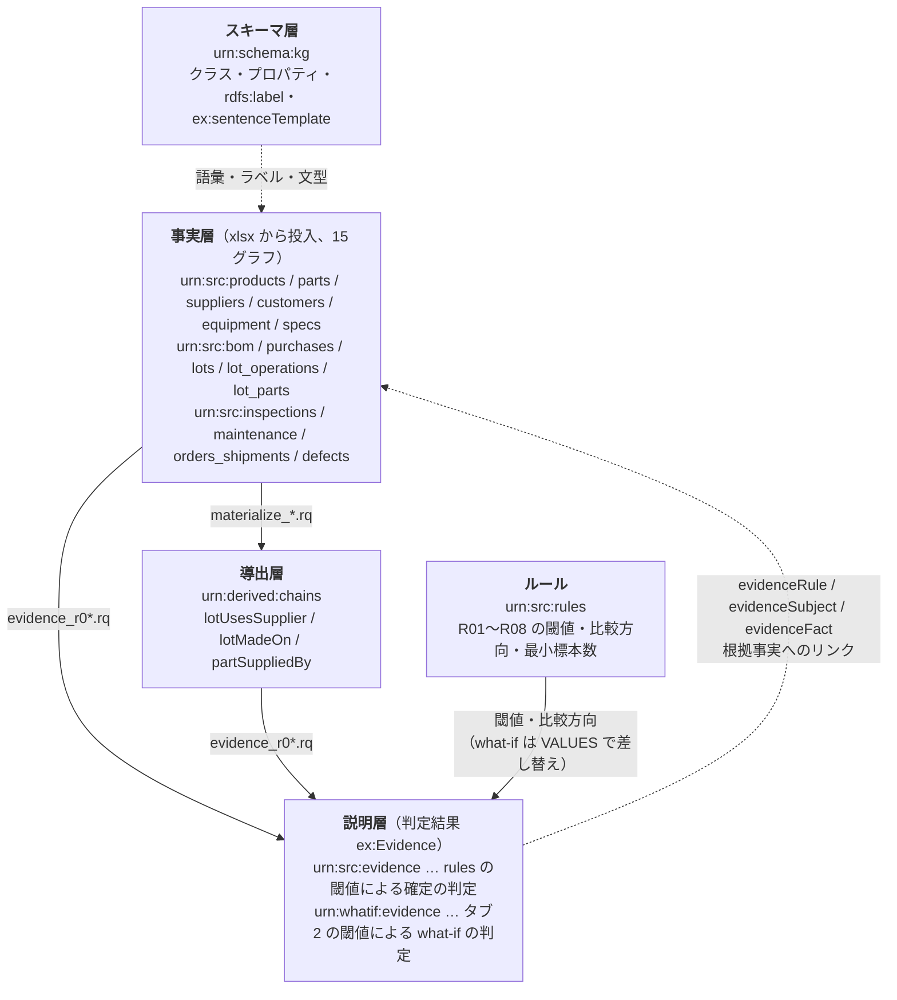
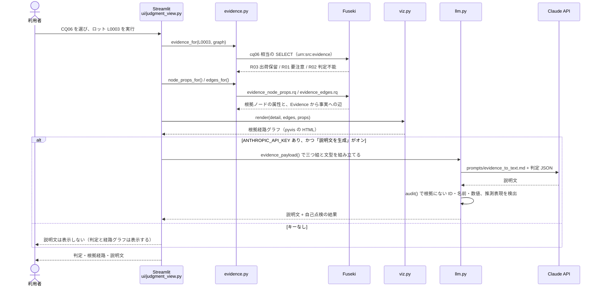

# アーキテクチャ

このデモの構成要素と、データが合成データ（xlsx）から判定・説明文になるまでの流れ。
図は Mermaid で書いている（GitHub 上ではそのまま図として表示される）。

## 1. 全体構成

| 要素 | 役割 | 方針 |
| --- | --- | --- |
| `scripts/xlsx_to_rdf.py` | シートごとに名前付きグラフ `urn:src:<シート名>` の TriG を作り、SHACL で検証する | 違反があれば投入しない（exit 1） |
| `src/load.py` | スキーマと 16 グラフを投入し、実体化と判定まで一括で実行する | Fuseki の Reasoner は使わない |
| `queries/` | CQ・判定・実体化・アプリ用の SPARQL をすべて置く | SPARQL を Python に埋め込まない。対象は `VALUES` 行を差し替える |
| `src/evidence.py` | 判定クエリを実行し、結果を `ex:Evidence` として書き戻す | CLEAR と INSERT を1リクエスト（1トランザクション）で実行する |
| `src/validate.py` | 判定後に Fuseki 上の全グラフを SHACL で検証する（`load.py` の最後でも実行する） | Evidence に根拠が付いていること、根拠事実の日付が評価時点より前であること、ロット判定の根拠の保全・購買が製造開始日以前であることを確かめる |
| `src/llm.py` | 根拠経路の三つ組から説明文を作る。自然文から SPARQL を作る | 数値計算と判定は LLM にさせない。生成した説明文は `audit()` で根拠データと突き合わせる。生成した SPARQL は承認後にだけ実行する |
| Claude API | 上記 2 つの生成だけを担う | API キーがなくても、判定・経路グラフ・what-if は動く |

## 2. 名前付きグラフの層

Fuseki は `tdb2:unionDefaultGraph true` で構成している。そのため、`GRAPH` 句のないクエリは全名前付きグラフの和を参照する。

Evidence は、結論・適用ルール・根拠事実へのリンクを1ノードにまとめたものである。この Evidence から事実層へ辿り直せることが「結論に至った理由をトリプル経路で説明できる」ことの実体になる。

## 3. 判定から説明文まで（タブ1 の CQ06）

タブ2「閾値を変える」で再判定すると、`evidence.evaluate(graph=urn:whatif:evidence, overrides=…)` が同じ判定クエリを実行し、結果を what-if 用のグラフに書く。タブ1 の「参照する判定」で `urn:src:evidence` と `urn:whatif:evidence` を切り替えると、同じ流れで経路を比べられる。
